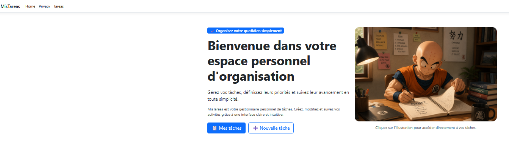
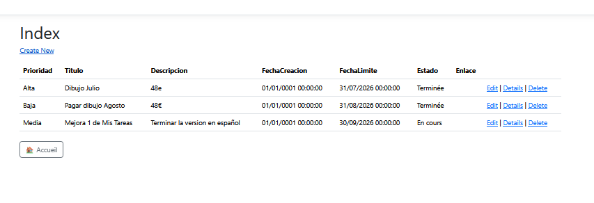
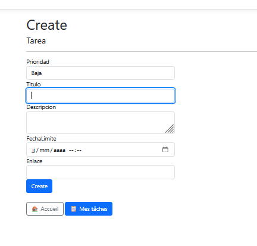
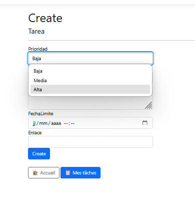

# MisTareas
<<<<<<< HEAD

=======
>>>>>>> 122a8c6 (Actualizar README y capturas de MisTareas)

Aplicación web de gestión de tareas desarrollada durante mi formación en Desarrollo de Aplicaciones Web (DAW).

Proyecto de aprendizaje para practicar ASP.NET Core MVC, las operaciones CRUD, la autenticación y el almacenamiento de datos.

> Proyecto en desarrollo.

## Funcionalidades actuales

- Registro e inicio de sesión mediante ASP.NET Core Identity.
- Acceso a la gestión de tareas para usuarios autenticados.
- Creación, consulta, modificación y eliminación de tareas.
- Gestión de prioridad, título, descripción, estado, fecha límite y enlace.
- Almacenamiento en SQL Server y migraciones con Entity Framework Core.
- Interfaz con Razor y Bootstrap.

Actualmente, las tareas todavía no se filtran por usuario. La asociación de cada tarea a su propietario está pendiente de completar.

## Tecnologías

C# · .NET 9 · ASP.NET Core MVC · Entity Framework Core · SQL Server / LocalDB · ASP.NET Core Identity · Razor · Bootstrap

## Capturas

### Inicio


### Lista de tareas


### Crear una tarea


### Selección de prioridad


## Ejecución local

### Requisitos

- Visual Studio con soporte para .NET 9 y desarrollo web ASP.NET.
- SDK de .NET 9.
- SQL Server LocalDB.

### Instalación

1. Clonar el repositorio:

   ```bash
   git clone https://github.com/Laurent-Git2/MisTareas.git
   ```

2. Abrir `MisTareas.sln` en Visual Studio y restaurar los paquetes NuGet.

3. Revisar la cadena de conexión a la base de datos y adaptarla al entorno local.

4. En la consola del Administrador de paquetes, seleccionar el proyecto MisTareas y aplicar las migraciones:

   ```powershell
   Update-Database
   ```

5. Ejecutar la aplicación desde Visual Studio mediante el perfil HTTPS.

## Próximas mejoras

- Asociar cada tarea al usuario que la crea y mostrar únicamente sus tareas.
- Completar una interfaz en español y francés.
- Añadir filtros por prioridad, estado y fecha.
- Mejorar las validaciones y el diseño responsive.
- Integrar una función de inteligencia artificial para ayudar a organizar, priorizar y dividir una tarea en pasos más sencillos.

## Autor

Laurent Sontag  
Estudiante de DAW · IES Mare Nostrum

[Perfil de GitHub](https://github.com/Laurent-Git2)